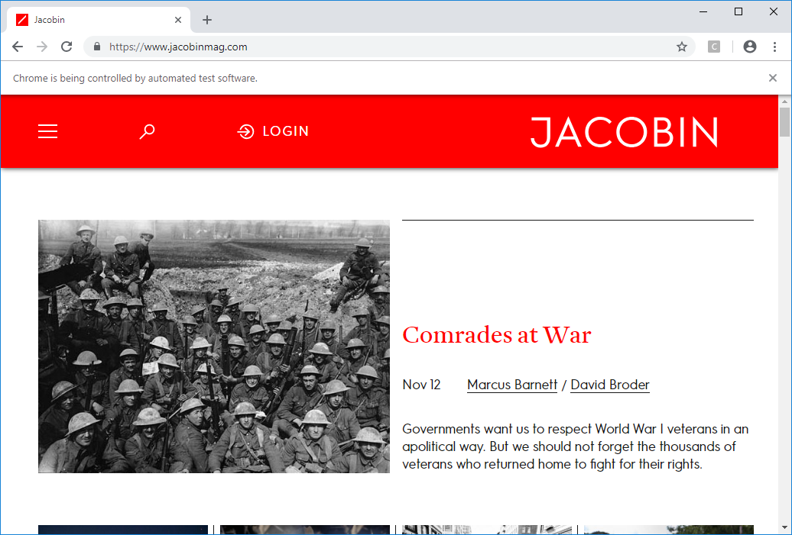

```{r setup, include=FALSE}
knitr::opts_chunk$set(echo = TRUE)
```

Since last week was a lot of me talking about stuff before we got to see any code, this week we're gonna dive right in to make up for it.

The term "web scraping" is actually somewhat ambiguous, as there are many different ways of downloading information off of a website and into a structured data format. Today we'll learn the following four, which probably cover... 98% of all the cases:

1. HTTP Request Scraping
2. Browser Simulation Scraping
3. API Scraping
4. Full Website Scraping

In my experience, I'd say HTTP Request Scraping covers about 80% of cases I've done, API Scraping another 10%, and then another 4% each for Browser Simulation and Full Website Scraping (with the remaining 2% being... weird stuff like connecting to a remote database, stuff we don't need to worry about for this workshop). So what are these buzzwords?

## HTTP Request Scraping

"HTTP" stands for **HyperText Transfer Protocol**. "HyperText" provides the first two letters of the acronym "HTML", or **HyperText Markup Language**. Combining these two, we can see that HTTP is a protocol for transferring HTML between computers over the internet. Cool.

The actual "innards" of HTTP you mostly don't need to worry about. For this workshop we'll focus on what are called "GET requests", though I'll also mention what "POST requests" are. GET requests are messages you can send to a remote computer, asking it for a certain file (POST requests just add the additional feature that you can send data -- for example a completed form -- to the server, on top of just asking for a file).

Now to the actual code! The library we'll be using is called `rvest`, so you'll need to go to your console in R Studio and run `install.packages("rvest")`. Once that's done, `rvest` can be loaded into working memory whenever we want. So let's start a new file, `blog_scrape.Rmd`, where we'll put our scraping code as we go along. Which gives away the theme of the next part...

### Scraping Blog Posts

I'm going to use the HTTP Request scraping method to download all the posts on (the first page of) a blog[^first]. Specifically, [Matt Breunig's blog](http://mattbruenig.com/), chosen based on maximizing simplicity and current-events-ness and minimizing insufferable-ness. Since it uses WordPress, you'll be learning how to scrape over 60 million other websites too -- it's by far the most widely-used blogging platform. In other words, since WordPress is a blog publishing "framework", any site using it will have almost identical HTML, with only the titles and post text (as well as style, which goes in a separate CSS file anyways) changed.

So the first thing to do when trying to scrape a website is almost always right-clicking on the page, clicking "View Source", and then Ctrl+F searching for the title of the first post. In most cases (even outside of WordPress) this will let you instantly see the format of the HTML code for the post. In our case, here is what we see if we search "Trump NLRB Smashed Google Guy" (the [latest post](http://mattbruenig.com/2018/02/16/trump-nlrb-smashed-google-guy/) as of 4:47am on November 12, 2018):
```html
</header><!-- .site-header -->

		<div id="content" class="site-content">

	<div id="primary" class="content-area">
		<main id="main" class="site-main" role="main">

		
			
			
<article id="post-14012" class="post-14012 post type-post status-publish format-standard hentry category-labor">
	<header class="entry-header">
		
		<h2 class="entry-title"><a href="http://mattbruenig.com/2018/02/16/trump-nlrb-smashed-google-guy/" rel="bookmark">Trump NLRB Smashed Google Guy</a></h2>	</header><!-- .entry-header -->

	
	
	<div class="entry-content">
		<p>In August of last year, I <a href="http://mattbruenig.com/2017/08/10/the-trump-nlrb-will-smash-the-google-guy/">wrote</a> that the new Republican-led NLRB would reject James Damore&#8217;s unfair labor practice charge. I argued that they would do so, not because long-standing NLRB law requires them to, but rather because the management-side attorneys that lead Republican NLRB administrations want to give management as much discretion as possible to fire people. We learned today that this is precisely what <a href="https://drive.google.com/file/d/1K1JRtRYBLyhhgkJLXnW2Nxjo5Bn6lw5V/view">ended up</a> happening.</p>
```
Handwaving over an entire HTML lesson (we're already time crunched :( ), just notice that you have text surrounded by tags which look like:
```html
<tagname attribute-name=attribute-value>The text</tagname>
```
Specifically, we see seemingly-important things around the title like `<h2 class="entry-title">` and then around the content like `<div class="entry-content">`. So let's start by downloading the HTML of the homepage into an R character variable:
```{r,download-html}
library(rvest)
blog_html <- read_html("http://mattbruenig.com")
blog_html
```
Now, it's time to quickly leap to the next level of R awesomeness, by way of the ["TIDYVERSE"](https://www.tidyverse.org/). Long story short, the tidyverse is a set of R packages with a unified "semantic philosophy" about how coding should work, and to be honest it feels much closer to how my brain works when doing "data science" than standard R syntax does. I don't encounter R enough to really know how many people use standard R functions vs. how many have entered the tidyverse, but it's definitely a not-insignificant number. I'd be willing to bet a majority of "data scientists" use the tidyverse.

[TODO: tidyverse tutorial]

So, now that you know the basics of how `dplyr` works, let's use it to "pipe" the html code we downloaded into a simple processing pipeline:
```{r,search-html}
title_nodes <- blog_html %>% html_nodes(".entry-title")
title_nodes
```
Which tells us that we have 3 posts on the first page that we can scrape. Next, let's do the same thing to get the *content* of the posts:
```{r,html-content}
content_nodes <- blog_html %>% html_nodes(".entry-content")
content_nodes
```
Cool, 3 content nodes matching the 3 titles from before.

Now if we keep looking at the source in our browser, we notice that although the titles are contained *within* the `<h2 class="entry-title">` node, they're actually directly inside an `<a>` tag (which is used to make hyperlinks) nested within the `<h2>`. So we add another `html_nodes()` to the processing "chain", to scoop out the link within each of the `<h2>`s we extracted before:
```{r,scoop-link}
link_nodes <- blog_html %>% html_nodes(".entry-title") %>% html_nodes("a")
link_nodes
```
Cool, we're one level closer to the title text! And it hopefully gave you a good example of the intuitiveness of the `%>%` operator with respect to constructing multi-step data processing pipelines.

Now, as a last step, we can zoom in even further and get *just* the text of the title, i.e., zooming "inside" the `<a>` tag. Note that the `trim=TRUE` option just removes any extraneous spaces at the beginning or end of the extracted string, and is mostly there just to show you how you can provide *optional* arguments to the tidyverse-style functions:
```{r,zoom-title}
titles <- blog_html %>% html_nodes(".entry-title") %>% html_nodes("a") %>% html_text(trim=TRUE)
titles
```
Woohoo! Titles acquired. Now you can try to do the same sort of process to try and extract just the text of the post *contents*... I'll give you a few minutes to try.

Now that you've tried, here's one answer (out of many possible ways of doing it):
```{r,zoom-content}
contents <- blog_html %>% html_nodes(".entry-content") %>% html_text(trim=TRUE)
contents %>% substr(start=1,stop=80)
```
Last but not least, we'll probably want the posted date as well, which looks to be inside a `<time class="entry-date published">` tag. This tag actually has two classes, `entry-date` and `published`, so we'll search for nodes with *both* of these classes by just squishing the two class selectors together inside the `html_nodes()` argument (We could just search for the `entry-date` class for simplicity in this case, but in general it's good to know how to search for multiple attributes):
```{r,get-dates}
dates <- blog_html %>%
    html_nodes(".entry-date.published") %>%
    html_text(trim=TRUE)
dates
```
Good stuff. Now real quickly I do a final scrape of the *links* to each post, just in case we want to go back and check them later or something:
```{r,get-hrefs}
urls <- 
    blog_html %>%
    html_nodes(".entry-title") %>%
    html_nodes("a") %>%
    html_attr("href")
urls
```
Now we can do... whatever we want with our scraped data. For example, let's make a data.frame out of it and then save it to a .csv file!
```{r,save-scrape}
bruenig_df <- data.frame(title=titles,content=contents,date=dates,url=urls)
write.csv(bruenig_df, "Web_Scraping_files/bruenig.csv")
```
Or, if we want to hop over to the tidyverse, we can use a Tibble:
```{r,tibble-scrape}
library(tidyverse)
bruenig_tibble <- data_frame(title=titles,content=contents,date=dates,url=urls)
glimpse(bruenig_tibble)
bruenig_tibble
write_csv(bruenig_tibble,"Web_Scraping_files/bruenig_tibble.csv")
```
Anyone notice the one difference?

### Using Our Scraper on Other Websites

Just to show you how powerful this can be (especially if you restrict yourself to WordPress sites), here's a one-line scrape of a much more "complicated" blog:
```{r,landis}
landis_html <- 
    read_html("https://www.joshualandis.com/blog/") 
landis_titles <- landis_html %>%
    html_nodes(xpath="//a[@rel='bookmark']") %>%
    html_text(trim=TRUE)
landis_titles
landis_content <- landis_html %>%
    html_nodes(".entry") %>%
    html_text(trim=TRUE) %>%
    gsub(",",";",.)
landis_dates <- landis_html %>%
    html_nodes(".post-date-title") %>%
    html_text(trim=TRUE)
landis_urls <- landis_html %>%
    html_nodes(xpath="//a[@rel='bookmark']") %>%
    html_attr("href")
landis_tibble <- data_frame(title=landis_titles,content=landis_content,date=landis_dates,url=landis_urls)
landis_tibble
#write_csv(landis_tibble,"landis.csv")
#landis_df <- data.frame(title=landis_titles,content=landis_content,date=landis_dates,url=landis_urls)
write_csv(landis_tibble,"Web_Scraping_files/landis.csv")
```
The .csv will look wonky if you try to open it in Excel, because of Excel reasons, but if you re-open it in R you'll see that the data is preserved:
```{r,check-csv}
landis_data <- read_csv("Web_Scraping_files/landis.csv")
landis_data
```
So that's what I mean when I say "HTTP Request Scraping" -- we simply ask the server to give us the webpage, and then we parse the HTML of that page directly.

Some website aren't as straightforward as this, however. Oftentimes, especially as web technology becomes more and more advanced, they'll use things like

* JavaScript (JS): a programming language allowing on-the-fly modification (i.e., without requiring a reloading or refreshing of the page) of data on a webpage and
* Asynchronous Javascript and XML (AJAX): an extension to JavaScript allowing the page to make external web requests in the background and put the results of the request onto the page, again without the user havnig to reload or refresh the page.

For an example of both, notice how on Twitter when you scroll down to the "bottom" of the page, you don't have to click a "Next Page" button and wait for a whole new page to load. Instead it has "infinite scrolling", which means that when you get to the bottom it executes an AJAX request and instantly places the next page of tweets immediately after the last tweet on the current page. In these types of cases, we won't be able to use simple HTTP requests to get the data we want[^jshttp], since the data is *not* in the HTML itself -- it's added later via JS. So we instead have to simulate a user viewing the page inside an actual browser (which is the program that actually runs the JS code on a page).

[Note, however, that this is *not* always the case if the page requires a username and password login. In these cases, you can often just send an HTTP POST request providing the username and password, rather than having to do the more arduous Browser Simulation Scrape method described next.]

## Browser Simulation Scraping

The program I use to simulate a user navigating via a browser is called Selenium. It has APIs (Application Programming Interfaces, which we'll see more of later) in Python, Java, R, and many other languages you may use. In R, we'll use the package `RSelenium`, so you'll have to install that via `install.packages("RSelenium")` as we've done a few times now. Once it's installed, we can see the basics of how it works by running the following code (since this tutorial is compiled into a static `.md` file, you won't see the results here, but I'll run the code in R Studio during the workshop as a demo):
```{r,selenium-demo,eval=FALSE}
# Load the library
library(RSelenium)
# Create and open a Chrome window (controlled by R)
driver <- rsDriver(browser="Chrome")
# "client" is the specific R variable we can use to navigate within and between pages
client <- driver[["client"]]
# Use client's navigate() function to go to a specific website
client$navigate("http://www.jacobinmag.com")
```


The main things you'll notice are (a) the bare-bones version of Chrome that it uses (to prevent any add-ons or other modifications from interfering with the browsing) and (b) the bar on the top that says "Chrome is being controlled by automated test software", since Selenium was originally made for web developers to test their websites: for example, by writing a long series of selenium code blocks that test all the different ways a user would interact with the site.

#### Scraping an "Open Government"" Data Portal

So now, for actual data scraping, let's say we're trying to scrape data from [this portal](http://nregarep2.nic.in/netnrega/dynamic2/DynamicReport_new4.aspx) which provides a range of statistics relevant to India's [National Rural Employment Guarantee Act](https://en.wikipedia.org/wiki/National_Rural_Employment_Guarantee_Act,_2005). Viewing the source of the page and searching for the "View Data" or "Download Data" buttons, you'll see the following scary-looking HTML:
```HTML
<input type="submit" name="BtnSubmit" value="View data" onclick="javascript:WebForm_DoPostBackWithOptions(new WebForm_PostBackOptions(&quot;BtnSubmit&quot;, &quot;&quot;, true, &quot;&quot;, &quot;&quot;, false, false))" id="BtnSubmit" class="submitbutton" />
                            <input type="submit" name="Button1" value="Download data" onclick="javascript:WebForm_DoPostBackWithOptions(new WebForm_PostBackOptions(&quot;Button1&quot;, &quot;&quot;, true, &quot;&quot;, &quot;&quot;, false, false))" id="Button1" class="submitbutton" />
```
To "reverse engineer" this and try to get the data via HTTP requests on their own, we would have to go in and find where the `WebForm_DoPostBackWithOptions()` function is, where the `WebForm_PostBackOptions` class lives, and so on and so forth. Thus this qualifies as a case where it's probably easier to just simulate a browser loading the page and "clicking" the "Download Data" (or "View Data") button. First we load:
```{r,navigate-nrega,eval=FALSE}
client$navigate("http://nregarep2.nic.in/netnrega/dynamic2/DynamicReport_new4.aspx")
```


And now we can use RSelenium functions to left-click, right-click, and type anywhere on the page, or just record what text/images appear in what spots on the page. In this case, we'll just programmatically check the "Total job cards issued" indicator, the "Chhattisgarh", "Kerala", and "West Bengal" regions, and then "Download data" to obtain a .csv file with data on the number of cards for each of these three regions.

For "Total job cards issued", we search the source to find that its checkbox has id `"ChkLstFieldsWorkerA_1"`. We then use the `findElement()` and `clickElement()` functions to find this checkbox on the page and click it. Note that if `findElement()` does not return a big scary error, that means it successfully found the element.
```{r,nrega-indbox,eval=FALSE}
num_cards_box <- client$findElement(using="id","ChkLstFieldsWorkerA_1")
num_cards_box$clickElement()
```
Now we find the three region checkboxes we want and click each of them as well (we'll make a "clickRegion()" helper function so we don't have to duplicate the same code three times):
```{r,nrega-regionbox,eval=FALSE}
clickRegion <- function(region_name){
    print(paste0("Clicking box for ",region_name))
    region_xpath = paste0("//label[contains(text(),'",region_name,"')]")
    region_box <- client$findElement(using="xpath",region_xpath)
    region_box$clickElement()
}
clickRegion("Chhattisgarh")
clickRegion("Kerala")
clickRegion("West Bengal")
```
And now finally we can find and click the "Download data" button:
```{r,download-nrega,eval=FALSE}
download_btn <- client$findElement(using="id","dwnldDummy")
download_btn$clickElement()
```
Oftentimes it won't be that easy, however, since they usually won't be nice enough to let you download a file containing all the data you want. The more common case will be that it gives you a new webpage with the data in some sort of tabular format, as is the case when we click "View data" instead of "Download data" here:
```{r,view-nrega,eval=FALSE}
view_btn <- client$findElement(using="id","viewDummy")
view_btn$clickElement()
```
Viewing or inspecting the source, you'll see that the rows of data are all in `<tr>` element (table rows) with class "GridNormalRow" or "GridAlternate":


So we'll just grab the contents
```{r,scrape-table,eval=FALSE}
extract_row_data <- function(row_object){
    row_elts <- row_object$findChildElements("tag name","td")
    id <- unlist(row_elts[[1]]$getElementText())
    region <- unlist(row_elts[[2]]$getElementText())
    cards <- unlist(row_elts[[3]]$getElementText())
    return(setNames(c(id,region,cards),c("id","region","cards")))
}
norm_rows <- client$findElements(using="xpath","//tr[@class='GridNormalRow' or @class='GridAlternate']")
all_data <- t(sapply(norm_rows, extract_row_data))
nrega_df <- as_tibble(all_data)
write_csv(nrega_df,"Web_Scraping_files/nrega_data.csv")
```
And you can see the resulting .csv file within the `w2_files` directory. It looks like:
```{r,show-nrega-csv}
cat(readLines('Web_Scraping_files/nrega_data.csv'), sep = '\n')
```
Cool. When you're done using the R-controlled client, you can use `client$close()` to close the window. [And if you need to start it up again, you can use `client$open()`!]:
```{r,close-nrega,eval=FALSE}
# Close the window
client$close()
# Uh oh I forgot something, need to re-open
client$open()
# Ok now I'm good
client$close()
# Shut down the server as well... otherwise it slows your computer
driver$server$stop()
```

## API Scraping

Now that we've learned the two somewhat "hackish" ways of scraping data, we can now move to a much nicer way of getting data from the web. When a website actually *wants* people to download and use their data, they'll often provide an API -- an "Application Programming Interface" -- to make it easy for you to search their data, filter based on what particular attributes you want, and download in various data formats.

For example, Wikipedia provides an API (actually multiple APIs -- in this example we'll use the "normal" Wikipedia API along with the WikiData API which allows you to query a database containing a bunch of more structured data derived from all the Wikipedia articles), which means that they give access to a special url that looks like:

`https://en.wikipedia.org/w/api.php?action=query&titles=South_African_Border_War&prop=images&imlimit=20&format=json`

which you can use to obtain a particular set of data you want. Remember that HTTP requests are just messages asking the server for a particular page. So in this case, we're asking it for a page with the info specified after `prop=`, using the Wikipedia article specified after `titles=`, in the JSON (JavaScript Object Notation) format.

<!-- [TODO: Quick JSON explanation] -->

In R, the library `jsonlite` is awesome and provides a convenient [`fromJSON()`](https://www.rdocumentation.org/packages/jsonlite/versions/1.5/topics/toJSON%2C%20fromJSON) function which will automatically parse the resulting JSON if you pass it a URL. So we'll be using that from here on out instead of `read_html()`.

### WikiData API

So let's "run" the query (i.e., just request the page using that special URL) on (plain) Wikipedia and see what the JSON data it gives back looks like. First we'll just ask for `templates`, which returns a list of templates included in the page:
```{r,query-wiki}
library(jsonlite)
json_result <- fromJSON("https://en.wikipedia.org/w/api.php?action=query&titles=South_African_Border_War&prop=templates&tllimit=25&format=json")
names(json_result)
names(json_result$query)
names(json_result$query$pages)
names(json_result$query$pages$`4000830`)
# Finally we found interesting things. So we'll save this into a var
wiki_data <- json_result$query$pages$`4000830`
# And start extracting
wiki_id <- wiki_data$pageid
wiki_id
wiki_title <- wiki_data$title
wiki_title
wiki_props <- wiki_data$pageprops
#claims_result <- fromJSON("https://wikidata.org/w/api.php?action=wbgetclaims&titles=South_African_Border_War&sites=enwiki&language=en&format=json")
#claims_result
#db_result <- fromJSON("https://wikidata.org/w/api.php?action=wbgetentities&titles=South_African_Border_War&sites=enwiki&language=en&format=json")
#db_result
```
The claims we have are things like:

* [`P910`](https://www.wikidata.org/wiki/Property:P910): The article's main category
* [`P646`](https://www.wikidata.org/wiki/Property:P646): The entity's id in the Freebase DB (see below)

Lastly, but obviously not leastly, we can get *just* the text of an article using the url in this code cell, which asks for output from the [`TextExtracts` *extension*](https://www.mediawiki.org/wiki/Extension:TextExtracts) to the API ("extension" here means that not all Wiki APIs support the `extracts` option):
```{r,wiki-text}
text_json <- fromJSON("https://en.wikipedia.org/w/api.php?action=query&prop=extracts&titles=South+African+Border+War&explaintext&format=json&exlimit=1")
full_text <- text_json$query$pages$`4000830`$extract
substr(full_text,0,1000)
```

### KnowledgeGraph (Freebase) API

You know that box of helpful info that comes up when you search for a thing on Google? For example, the box telling you 

Since I don't want to have my Google API Key saved in this tutorial, I load it from an external file (which is *not* pushed to GitHub). However, this means we're going to have to "leave a blank" in the url which we fill in with the value loaded from the file. This is where the [`sprintf()` function](https://en.wikipedia.org/wiki/Printf_format_string) comes in. Basically, anywhere in the string you want to leave a blank, just put:

* `%s` if you're going to fill it in with a string
* `%d` if you're going to fill it in with an integer
* `%f` if you're going to fill it in with a float (number with decimal points)
```{r,kgraph}
api_key <- readLines("Web_Scraping_files/google_api_key.secret")
query_template <- "https://kgsearch.googleapis.com/v1/entities:search?query=%s&key=%s&limit=%d"
query_url <- sprintf(query_template, "south+african+border+war", api_key, 3)
kg_json <- fromJSON(query_url)
kg_results <- kg_json$itemListElement$result
kg_scores <- kg_json$itemListElement$resultScore
names <- unlist(kg_results["name"])
kg_ids <- unlist(kg_results["@id"])
kg_df <- tibble(name=names, score=kg_scores, kg_id=kg_ids)
kg_df
```
We see that of the three results, the first one has the highest `resultScore` value. So we pick this one and make another API request to obtain info about it:
```{r,kgraph-info}
# Get just the id, stripping out the "kg:" prefix
borderwar_id <- kg_df %>%
    filter(name=="South African Border War") %>%
    select("kg_id") %>%
    as.character() %>%
    gsub("kg:","",.)
id_template <- "https://kgsearch.googleapis.com/v1/entities:search?ids=%s&key=%s"
id_url <- sprintf(id_template, borderwar_id, api_key)
id_json <- fromJSON(id_url)
id_result <- id_json$itemListElement$result
# Use colnames() function to see what data we have
colnames(id_result)
# Print the detailed description
id_result$detailedDescription$articleBody
# And get the image url
image_url <- id_result$image$contentUrl
image_url
```
The image looks like

`r sprintf("", image_url)`

And as in all the previous examples we could now go and make a tibble and export to a .csv file.

Before we move to the Full Website Scrape, a quick final note: For some sites you may have to "trick" the server into thinking you're sending a request from a normal browser, to avoid being blocked. Every time you send an HTTP request, the request message contains a *header* with information about you and your browser. For example, you send a "User-Agent String" which gives the server information about what browser and OS you're using. Mine looks like

`Mozilla/5.0 (Windows NT 10.0; Win64; x64; rv:64.0) Gecko/20100101 Firefox/64.0`

But an Android phone's User-Agent String would look like:

`Mozilla/5.0 (Linux; Android 6.0.1; SM-G532G Build/MMB29T) AppleWebKit/537.36 (KHTML, like Gecko) Chrome/63.0.3239.83 Mobile Safari/537.36`

You can find the User-Agent that you're sending out by visiting [this helpful link](http://httpbin.org/user-agent). For example let's look at what gets sent when we use the `fromJSON()` and `read_html` functions:
```{r,secret-google}
my_ua_json <- fromJSON("http://httpbin.org/user-agent")
json_ua <- my_ua_json$`user-agent`
# Weird regular expression stuff, don't worry about it...
ua_regex <- "\"user-agent\": \"(.+)\"\n"
ua_response <- read_html("http://httpbin.org/user-agent") %>% html_text(trim=TRUE)
readhtml_ua <- str_match(ua_response,ua_regex)[,2]
readhtml_ua
```
Most importantly, in R while we can't use the very simple `read_html()` to "spoof" a User-Agent String (i.e., replace it with a custom string before sending), this function is really just a simplifying wrapper around the function [`GET()`](https://www.rdocumentation.org/packages/httr/versions/1.3.1/topics/GET) from the library `httr`[^httr]. So we now load that library and use `GET()` to send a custom header:
```{r,custom-header}
library(httr)
new_ua <- "Secret Underground Hacker Lair Browser 2.0"
httr_response <- GET("http://httpbin.org/user-agent", user_agent(new_ua))
httr_ua <- httr::content(httr_response)$`user-agent`
httr_ua
```

## Full Website Scraping

In this final scraping method our goal is not to download data from a page or an API, but to actually copy the *entire* website for offline use. I personally don't know how to do this in R. But I *have* used the [HTTrack Website Copier](https://www.httrack.com/) to scrape a ton of websites, so I highly recommend checking that out. So... yeah. Short section here. Onwards and upwards to *doing* things with our scraped data!

## Bibliography

[^first]: I only scrape the first page for the sake of time, but scraping all pages usually just requires going on the blog, looking at how the URL in your URL bar changes as you click "Next Page", and then replicating that pattern in code. For example, if the homepage is `coolblog.com`, maybe as you click "Next Page" you see it changing to `coolblog.com/?p=1`, `coolblog.com/?p=2`, and so on. What this means is that clicking "Next Page" just makes your browser request the same "page" but with a different `p` parameter, which probably stands for "page". Once you know this pattern, you can just write a loop in R that scrapes each page individually as we do for the home page above.
[^jshttp]: Technically it's possible in some cases -- for example you could figure out how the JavaScript code works and then just HTTP request the pages that it AJAX-requests in the background -- but it's not at all trivial.
[^httr]: Unrelated to the DC football team...
