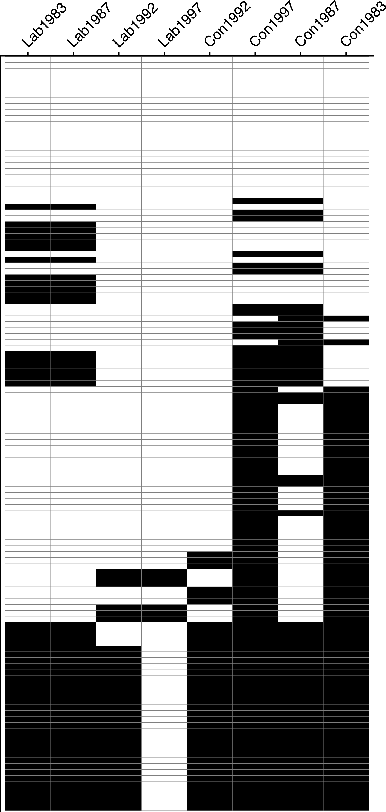
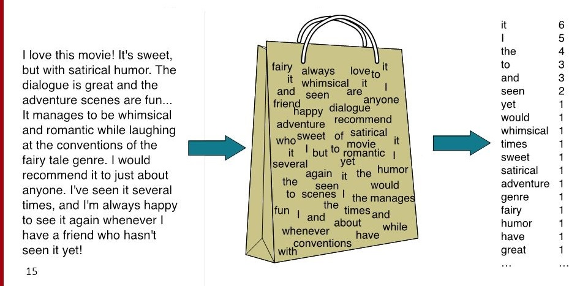
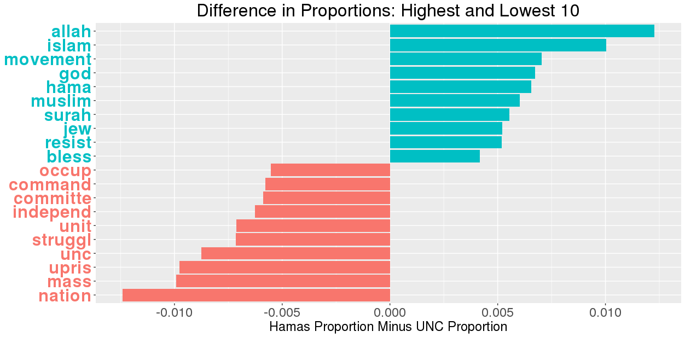

<script src="code_fold2.js"></script>

# Text Analysis 101

This session is essentially "Text Analysis 101", in that it contains steps you're going to perform basically no matter *what* particular text analysis method you're hoping to use. The basic pipeline for a text-analysis project (at least, for a one-off text corpus analysis) looks like: [if you're rendering this tutorial manually, you'll need to install the `Gmisc` package to generate this diagram]
<div id="diag1">
```{r,text-pipeline,message=FALSE}
library(grid)
library(Gmisc)
# Set arrow options
options(connectGrobArrow = 
          arrow(ends="last", type="closed",
                length=unit("3","mm"),
                angle="20"))
# set some parameters to use repeatedly
leftx <- .25
midx <- .5
rightx <- .75
width <- .75
height <- 0.08
box_opt <- gpar(fill = "lightgrey")
txt_opt <- gpar(cex=1.1, fontface="bold")
# create boxes
h_inc <- 0.12

(csv <- boxGrob("Unstructured text (\"out in the world\")", 
 x=midx, y=0.82, box_gp = box_opt, txt_gp=txt_opt, width = width, height=0.08))

(df <- boxGrob("Organized text w/metadata", 
 x=midx, y=0.70, box_gp = box_opt, txt_gp=txt_opt, width = width, height=height))
# connect boxes like this
connectGrob(csv, df, "v")

(corpus <- boxGrob("Text and metadata loaded into an R variable", 
 x=midx, y=0.58, box_gp = box_opt, txt_gp=txt_opt, width = width, height=height))
connectGrob(df, corpus, "N")

(preproc <- boxGrob("Text preprocessing", 
 x=midx, y=0.46, box_gp = box_opt, txt_gp=txt_opt, width = width, height=height))
connectGrob(corpus, preproc, "v")

(dtm <- boxGrob("Conversion to numeric data\n(Document-Term Matrix (DTM))", 
 x=midx, y=0.3, box_gp = box_opt, txt_gp=txt_opt, width = width, height=2*height))
connectGrob(preproc, dtm, "N")

(freq <- boxGrob("Text-as-data methods\n(Transformations of DTM)", 
 x=midx, y=0.1, box_gp = box_opt, txt_gp=txt_opt, width = width, height=2*height))
connectGrob(dtm, freq, "v")
```
</div>

With that said, there's a more limited "easy way" and a more versatile "hard way" to do these basic steps.

The easy way will let you get up and running and learning some rudimentary things about your text corpus in... less than 30 minutes? This easy way is achieved using the `tm` package in R, short for "Text Mining". In a nutshell, this package has a pipeline that looks like:
<div id="diag2">
```{r,tm-pipeline}
library(grid)
library(Gmisc)
grid.newpage()
# set some parameters to use repeatedly
leftx <- .25
midx <- .5
rightx <- .75
width <- .4
box_opt <- gpar(fill = "lightgrey")
txt_opt <- gpar(cex=1.1, fontface="bold")
# create boxes
(csv <- boxGrob("Corpus in csv format", 
 x=midx, y=0.85, box_gp = box_opt, txt_gp=txt_opt, width = width, height=0.08))

(df <- boxGrob("data.frame", 
 x=midx, y=0.7, box_gp = box_opt, txt_gp=txt_opt, width = width, height=0.08))
# connect boxes like this
connectGrob(csv, df, "v")

(corpus <- boxGrob("Corpus object", 
 x=midx, y=0.55, box_gp = box_opt, txt_gp=txt_opt, width = width, height=0.08))
connectGrob(df, corpus, "N")

(preproc <- boxGrob("Preprocessing", 
 x=midx, y=0.4, box_gp = box_opt, txt_gp=txt_opt, width = width, height=0.08))
connectGrob(corpus, preproc, "v")

(dtm <- boxGrob("DocumentTermMatrix", 
 x=midx, y=0.25, box_gp = box_opt, txt_gp=txt_opt, width = width, height=0.08))
connectGrob(preproc, dtm, "N")

(freq <- boxGrob("Frequency analysis", 
 x=midx, y=0.1, box_gp = box_opt, txt_gp=txt_opt, width = width, height=0.08))
connectGrob(dtm, freq, "v")
```
</div>

In words: you start with your corpus in a basic data format and load it into a dataframe object using the functions you've learned (either R's built-in `read.csv()` or the better alternative `fread()` from the `data.table` package). You then use `tm`'s `Corpus` function to convert the datatable into a `Corpus` object. Next you "convert" this `Corpus` into numerical form via `DocumentTermMatrix()` (again from `tm`), and perform whatever analysis you want on this Document-Term Matrix (DTM).

Here I want to point out that most text-as-data methods can actually be boiled down to just fancy transformations on a DTM. Both [Latent Semantic Analysis (LSA)](https://en.wikipedia.org/wiki/Latent_semantic_analysis), one of the earliest text-as-data methods (and the precursor to topic models, which use a variant called [Latent Dirichlet Allocation (LDA)](https://en.wikipedia.org/wiki/Latent_Dirichlet_allocation)) and [word embeddings](https://towardsdatascience.com/introduction-to-word-embedding-and-word2vec-652d0c2060fa), for example, transform this matrix so that the rows of the resulting matrix represent *topics* (in the LSA case) or *words* (in the word embedding case). Onto the code!

# Using the textmining (`tm`) package

First things first, you're going to need to install `tm` by running `install.packages("tm")` from the Console. Once it's installed, you can load it into R's working memory at any time by including `library(tm)` at the top of your code.

## Loading data from .csv

Let's begin by loading our `csv` file into an R dataframe. Just like last week, I use `fread(<filename>)` to load the data and store the resulting dataframe into a variable called `UN_speeches` (you'll see why we're using the `_ascii` version later on):
```{r,load-un-speech}
library(data.table)
UN_speeches <- fread("corpora/UNGDC_2017_ascii.csv")
# Use -8 for the column filter to exclude column 8,
# so that it doesn't print out all the (long) speeches
head(UN_speeches[,-8])
```
## Constructing the Corpus object

Next we want to tell `tm` that the data in this dataframe is actually *text* data that we want it to work with. To do this, we use its `Corpus()` function, which requires a *source* argument. This source argument can be one of: `VectorSource`, `DataframeSource`, or `DirSource`. Hopefully these are fairly self-explanatory, but just in case:

* `VectorSource` takes in *just* a vector of strings (e.g., `c("first text","here's the second text","a third text")`) and treats each string as a text document,
* `DataframeSource` takes in an entire dataframe, with one column specified as the column holding your text documents, and treats the remaining columns as metadata, and
* `DirSource` takes in the path to a directory (e.g., `"C:\\Documents\\My_Corpus"`), loads all `.txt` files within that directory into memory, and treats the contents of each file as a text document.

In this case, we're going to use `DataframeSource`, since it will let us tell `tm` about both the text data and the (numeric or categorical) metadata in one go. However, you'll get an error trying to use the dataframe as-is:
```{r,corpus-obj,error=TRUE}
library(tm)
UN_corpus <- Corpus(DataframeSource(UN_speeches))
```
It looks scary, but all it's saying is "I was looking for a column named `doc_id` and a column named `text`, and didn't find them in your dataframe". As the documentation for DataframeSource mentions: "The first column must be named 'doc_id' and contain a unique string identifier for each document. The second column must be named 'text'". It's probably easiest to use `country_code` as our unique id variable, so we rename that column to `doc_id`, and we're good:
```{r,rename-id}
# Use 7 since country_code is the *seventh* column
names(UN_speeches)[7] <- "doc_id"
# Check that our rename worked
names(UN_speeches)
```
Now our above code should work:
```{r,fixed-corpus}
UN_corpus <- Corpus(DataframeSource(UN_speeches))
UN_corpus
```
This tells us two things:

1. That our corpus contains 196 documents, and
2. That we have 8 metadata variables, on top of the `doc_id` and `text` columns.

So now our `Corpus` object is ready to use. Just as a sanity check (or, if this is the first time you're looking at the corpus, to get your bearings), you can use the double-square-brackets notation `[[<doc_num>]]` on your Corpus object to access the text for a particular document. However, you will get an error if you try *just* the double-brackets:
```{r,view-doc-error,error=TRUE}
UN_corpus[[5]]
```
What this means is that R doesn't understand `UN_corpus[[5]]` as a string. The issue is that `tm` is keeping track of additional information above and beyond just the text, and *all* of this data is given to you when you use the double-brackets. So what you need to do is "drill down" to just the text, which is stored in the `content` field *within* the object that the double-brackets gives you:
```{r,view-doc}
doc5_data <- UN_corpus[[5]]
doc5_text <- doc5_data$content
# Just show the first 500 characters in the document
substr(doc5_text,1,500)
# And display our metadata
doc5_data$meta
```

For sanity purposes, I define a simple `peek_textnum()` function now, so that we don't have to worry about the square-bracket or `$content` or `substr()` stuff anymore:
```{r,peek-textnum}
peek_textnum <- function(corpus, doc_num, start_char, end_char){
  doc_data <- corpus[[doc_num]]
  doc_text <- doc_data$content
  doc_head <- substr(doc_text, start_char, end_char)
  return(doc_head)
}
```
So now we can print (for example) the first 300 characters of the 10th document by running:
```{r,peek-textnum-example}
peek_textnum(UN_corpus, 10, 1, 300)
```
Although this is useful for sanity checks, typically we'd like to be able to view the text for a *specific* country we are interested in. For this, I write a separate function `peek_country()`, which takes a *country code* as its first parameter, finds the document number for that country, and passes it onto `peek_textnum()`. Note that the `meta()` function, e.g. `meta(UN_corpus)`, "pulls out" just the metadata table for our corpus, which has a `country_code` variable:
```{r,peek-country}
peek_country <- function(corpus, country_code, start_char, end_char){
  country_data <- corpus[[country_code]]
  country_text <- country_data$content
  doc_head <- substr(country_text, start_char, end_char)
  return(doc_head)
}
```
So now we can do things like:
```{r,search-country}
peek_country(UN_corpus, "VEN", 1, 280)
```
One final thing: if you're lazy like me and want to get a list of the country codes without having to open the .csv or click the spreadsheet icon in the Environment panel, just use `names()` to look at the names of each document:
```{r,country-codes}
names(UN_corpus)
```

Before we can move to the step of constructing our Document-Term Matrix, however, we'll need to do some initial **preprocessing** of the data.

## Preprocessing: Caveat Utilitor

Preprocessing is probably the most-ignored part of the text processing pipeline. However, as @denny_text_2018 has shown convincingly (and scarily), it's possible to diminish or even *reverse* your results by using a sufficiently "bad" preprocessing pipeline:

{width=400px}

So just keep this graph on the front of your mind whenever you are running the preprocessing step D: As a final point before we start coding, we need to understand what the *end goal* is. And to understanding *this* we need to understand how computers "read" text, which is where the "Bag-of-Words Assumption" comes in.

## The Bag-of-Words Assumption (Why?)

Long story short, for most *social science* applications of text-as-data (the opposite is true for *linguistics* applications, so if you're a linguist close the window right now), we make a scary but important simplifying assumption: the **Bag-of-Words Assumption**. What this means, as its name implies, is that we take all of the words out of a document and toss them into a "bag": just as object lose their ordering when we toss them into a bag, the words in the document lose their ordering when we toss them into our metaphorical bag:



The rationale here is basically that whatever semantic information we *lose* by tossing word order out the window, we more than make up for it with what we *gain* in terms of the computer's ability to draw general semantic inferences. To understand why, let's take the example of a computer trying to make an inference regarding the similarity between the sentence "I love cats!" and "Cats are lovely.". To humans, obviously, these are quite semantically "close", only differing in that the former is being *exclaimed* while the latter is just being stated.

Now think about how the computer would have to represent these sentences if we wanted it to retain order. It would need a way to represent information about both the words *and* their order. Due to the architecture of a computer, all information eventually boils down to vectors -- lists of numbers[^ascii]. The first sentence would then need to be stored in such a way that the computer retains all of the word-order information, for example via:
```{r,cats1}
sentence1 <- c("I_1","love_2","cats_3","!_4")
sentence1
sentence2 <- c("Cats_1","are_2","lovely_3","._4")
sentence2
```
Now if you look closely at these two lists, you'll realize that they actually have *nothing* in common as-is. The computer, in this example, can only take its "units" of meaning -- the elements of the lists -- and test their overlap (remember that a word+order is a *unit* here. If we wanted it to look at the *letters* we'd need a different encoding, say `sentence1 <- "I_1"," _2","l_3","o_4","v_5","e_6",...`, and this would be even worse if you think through it...). Using a standard vector distance metric, the [Jaccard index](https://en.wikipedia.org/wiki/Jaccard_index), here's what we get:
```{r,jaccard}
compute_jaccard <- function(A, B){
  numerator <- length(intersect(A,B))
  denominator <- length(union(A,B))
  jaccard <- numerator / denominator
  return(jaccard)
}
compute_jaccard(sentence1,sentence2)
```

But this means something is wrong, since we definitely want the computer to detect the semantic similarity here. But no matter what, if we require the computer to retain order, it can't detect any similarities. For example, let's do some standard preprocessing steps (lowercasing, removing punctuation, and stemming, i.e., reducing words down to their "root" forms: `"jumping"` and `"jumper"` both get transformed to `"jump"`):
```{r,cats2}
sentence1 <- c("i_1","love_2","cats_3")
sentence1
sentence2 <- c("cats_1","are_2","love_3")
sentence2
compute_jaccard(sentence1,sentence2)
```
Still no matches. But now let's remove the word order:
```{r,cats3}
sentence1 <- c("i","love","cats")
sentence1
sentence2 <- c("cats","are","love")
sentence2
compute_jaccard(sentence1,sentence2)
```
Awesome. Now even with just *three* words per sentence, and *two* sentences total, we were able to derive some meaningful inference about the semantics of the sentences. I know this is a toy example, but its what's at the heart of the bag-of-words assumption: that processing a bag-of-words is a *farrrr* more efficient use of the information in the sentence than if we treat (for example) "cats" in the first slot as a completely different unit from "cats" in the third slot.

Also, now you can hopefully see why this would be a *bad* assumption for linguists: if you're trying to parse a sentence, for example to derive its [dependency tree](https://en.wikipedia.org/wiki/Parse_tree#Dependency-based_parse_trees), we have the opposite situation: now we use the information in the sentence in a *maximally* efficient way by retaining word order, and if we *remove* order we get no information we can use to obtain the outcome we want. So the moral of the whole story is that bag-of-words is not a "universal" assumption in linguistics or anything like that, just a heuristic used in computer science and computational social science to allow us to efficiently draw the inferences that we want to draw. Dependency trees are less social-scientifically useful than, for example, a distribution of policy positions derived from [a corpus of political manifestos](https://manifesto-project.wzb.eu/).

## The Preprocessing Pipeline (How?)

In the figure from @denny_text_2018 above, each tiny row represents one of 128 different combinations of preprocessing steps. Each preprocessing step can either be "turned on" or "turned off", i.e., there are two choices for each slot in the pipeline, which means that they use $\log_2(128) = 7$ different preprocessing steps. Looking inside the paper (Section 2, pages 170-172), we see that the steps are:

* **Punctuation Removal**: Self-explanatory
* **Number Removal**: Any digits, from 0 to 9, are removed.
* **Lowercasing**: Self-explanatory
* **Stemming**: As mentioned above, words are "reduced" to their linguistic root form. Note however that the transformations are often extremely unintuitive. When I was doing my Bayanat (Communiques from the First Intifada) project, the stemmer collapsed "uniting", "united", and "unites" down to "uniti", but "unite" down to "unit", making (for example):

    $\textsf{Similarity}(\texttt{"units of measurement"},\texttt{"let us unite!"}) > \textsf{Similarity}(\texttt{"we must unite!"},\texttt{"we must be united!"})$

    So yeah, be careful about this step.
* **Stopword Removal**: Possibly the most "controversial" step. In fact there are [whole papers by well-respected text-as-data experts](https://aclanthology.coli.uni-saarland.de/papers/E17-2069/e17-2069) (@schofield_pulling_2017) saying that you *shouldn't* remove stopwords. I personally don't buy their argument (it does improve literally all the metrics across the board and they're making an arbitrary distinction between "small" and "large" improvements) but you should definitely think about it when you're on this step.

* **N-Gram Inclusion**: An "n-gram" is an ordered sequence of $n$ words pulled out of a sentence. Including these -- say 1-grams (words), 2-grams (pairs of words), and 3-grams (triples of words) -- does mitigate some of the fears of people who think we *need* to include word order. However, it can also exponentiate the amount of (text) data you need to process: Including 2-grams adds an order of magnitude more "tokens":

    $$\binom{n}{2} = \frac{n^2-n}{2} = O(n^2)$$

    while including *3-grams* adds an additional order of magnitude:
    
    $$\binom{n}{3} = \frac{n^3-3n^2+2n}{6} = O(n^3)$$.
    
    So I personally usually *don't* include n-grams unless my corpus is really really big... like (say) over 50,000 documents. Also note that tweets don't count as full "documents", since a "good" document length for topic modeling (to choose just one popular text-as-data method) is about 1000 words. See @boyd-graber_applications_2017 or @jockers_macroanalysis:_2013 for why.
* **Removing Infrequent Terms**: Unlike the stopword removal step, where you specify the *words* you want to remove, here you just define a *threshold* -- a minimum word frequency -- below which the word gets thrown out. So, for example, if you use a 1% threshold (the "commonly used rule of thumb" mentioned in the paper), any word appearing in less than 1% of the documents in the corpus will be thrown out.

So let's (finally) implement this pipeline in code! The first step in our pipeline will be to remove punctuation via the `tm_map()` function from the `tm` package, which we'll use throughout the preprocessing stage. All it does is take a **content transformer** that you give it (e.g., the `removePunctuation()` function) and run it on every document in your corpus separately. However, before we start, there are a few quirks with our data:

The original [UNGDC Corpus](http://www.smikhaylov.net/ungdc/) files used a text encoding called [UTF-8](https://en.wikipedia.org/wiki/UTF-8) which allowed it to contain accented letters and "fancy" punctuation marks. UTF-8, however, does not play well with `tm`, which was made to work with the ASCII ("standard" characters) encoding. Thus I made an ASCII-formatted version of the corpus, which replaces all "fancy" characters with two question marks `??`, so that they get removed when we remove punctuation. The problem, however, is that if you have a word like `"yesterday??s"`, which is *extremely* common since the UTF-8 character those `?`s replaced was a "curly apostrophe", this will turn into `"yesterdays"`, which has a completely different meaning. So to avoid this I write a content transformer that removes any `"s"` characters occurring right after the two question marks:
```{r,remove-s}
removeFinalS <- function(x){
  # fixed = TRUE is there because we want gsub() to read "??"
  # as a string with two question marks rather than a regular
  # expression (don't worry about it :/)
  return (gsub("??s", "??", x, fixed = TRUE))
}
# And a quick check that it works
removeFinalS("ABC??s")
```
All this does is take in a string `x`, look for the sequence `"??s"`, and replace it with `"??"` if found. So now we use `tm_map()` to apply it to every document in our corpus (using `content_transformer()` just to tell `tm_map` that we want it to "import" `removeFinalS` into its set of content transformers). I store the result in a new `UN_clean` variable so that we can compare the output and make sure it filtered correctly:
```{r,remove-s-apply}
# Apply removeFinalS() to every document in the corpus
UN_clean <- tm_map(UN_corpus, content_transformer(removeFinalS))
# Check that it worked
peek_country(UN_corpus, "PRT", 1, 200)
peek_country(UN_clean, "PRT", 1, 200)
```
Now we have one more quick cleanup task: hyphenated words like "peace-keeper" appear a lot in this corpus, so here I create another custom function `breakHyphens` that just replaces the `"-"` character with a space, so that e.g. "peace-keeper" becomes the two words "peace" and "keeper" (which, if we included 2-grams, would get "picked up" as an important two-word phrase later in the pipeline):
```{r,hyphens}
breakHyphens <- function(x){
  # fixed = TRUE is there because we want gsub() to read "??"
  # as a string with two question marks rather than a regular
  # expression (don't worry about it :/)
  return (gsub("-", " ", x, fixed = TRUE))
}
# And a quick check that it works before
breakHyphens("peace-keeper")
# Applying it to the whole corpus
UN_clean <- tm_map(UN_clean,content_transformer(breakHyphens))
```
And we again quickly check that it worked:
```{r,check-hyphens}
peek_country(UN_corpus, "AFG", 10500, 10800)
peek_country(UN_clean, "AFG", 10500, 10800)
```


Now that we've applied these custom functions, we're ready to begin the "standard" pipeline and **remove punctuation** using one of `tm`'s built-in content transformer, `removePunctuation`:
```{r,punctuation}
UN_clean <- tm_map(UN_clean, removePunctuation)
```
It's a bit underwhelming, since (if it worked) `tm` doesn't display anything, so let's sample a document to make sure that it really did remove all the punctuation:
```{r,check-punct}
peek_country(UN_corpus, "PRT", 1, 200)
peek_country(UN_clean, "PRT", 1, 200)
```
By the way, the reason I knew we could use `removePunctuation` as a valid content transformer for `tm_map` was by looking at the valid transformations list, which you can see by using this function:
```{r,tm-map}
getTransformations()
```
Next, we **remove numbers** and check that it worked again:
```{r,numbers}
UN_clean <- tm_map(UN_clean, removeNumbers)
peek_country(UN_corpus,"RUS",1,100)
peek_country(UN_clean,"RUS",1,100)
```
**Lowercasing all letters**. This one is a bit weird since `tm` doesn't have a built-in lowercaser -- so we could try to "import" R's built-in `tolower()` function into `tm_map()`. But here we can be a little "safer": `tolower()` is unable to handle "special" (unicode) characters, like the accents in tokens like ["Miroslav Lajčák"](https://en.wikipedia.org/wiki/Miroslav_Laj%C4%8D%C3%A1k), the last President of the UNGA. So instead (in case we decide to enter "hard mode" in the future by using the full fancy-characters version) we import the special-character-friendly `stri_trans_tolower()` function from the `stringi` library (`install.packages("stringi")` if you haven't downloaded it):
```{r,lowercase}
library(stringi)
UN_clean <- tm_map(UN_clean, content_transformer(stri_trans_tolower))
peek_country(UN_corpus, "YEM", 1, 200)
peek_country(UN_clean, "YEM", 1, 200)
```
Note that this function doesn't complain when it sees "Miroslav Lajčák", and it will even smoothly capitalize the accented characters as appropriate:
```{r,miroslav}
stri_trans_tolower("Miroslav Lajčák")
stri_trans_toupper("Miroslav Lajčák")
```
**Stemming** comes next. For this step we also import a function, this time the `stemDocument()` function from the `SnowballC` library. This library implements a "standard" widely-used English stemmer created using the broader [Snowball stemmer-programming language](https://en.wikipedia.org/wiki/Snowball_(programming_language)). Stemmers exist for tons of different languages, so if you're not working in English you should still be fine here (just import the `stem()` function from your particular stemmer):
```{r,stem}
library(SnowballC)
UN_clean <- tm_map(UN_clean,stemDocument)
peek_country(UN_corpus,"JAM",1,250)
peek_country(UN_clean,"JAM",1,250)
```
And lastly, **stopword removal**. While the collection of stopwords you decide to use can get contentious (they range in size from ~100 to ~1000), here we'll just use `tm`'s built in English stopword list, which you can access using `stopwords("english")`. 
```{r,stopwords}
UN_clean <- tm_map(UN_clean, removeWords, stopwords("english"))
peek_country(UN_corpus,"DNK",1,250)
peek_country(UN_clean,"DNK",1,250)
```
It's barely human-readable anymore, but it's in *exactly* the format that the computer can best extract information from, due to the issues we discussed above. So we're finally ready to construct our Document-Term Matrix!

## The Document-Term Matrix

```{r,dtm}
UN_dtm <- DocumentTermMatrix(UN_clean)
UN_dtm
```
This tells us that we have 196 documents (rows) and 8259 terms (columns), that 93% of the entries are zero, and that the largest term is 30 characters long. From the computer's perspective, this is the first object we've made that it can actually work with, derive inferences from, and so on. So let's quickly explore its properties.

First quiz question: what information would a *row sum* (a vector where each entry $i$ is the sum of all elements in row $i$ of the matrix) give us here?

The answer is: nothing that exciting, sadly, just a listing of how many words are in each document. To take the row sums in R, we'll have to use a special library called `slam`, since `UN_dtm` is a *sparse-format* matrix, not a standard R matrix. This sparse format is super important for the DTM, since a standard R matrix holding the same information would require
```{r,nonsparse-calc}
sparsity <- (1 - length(UN_dtm$v) / prod(dim(UN_dtm))) * 100
sparsity
space_saved <- sparsity * (nrow(UN_dtm)*ncol(UN_dtm))
space_saved
```
or about 150 million more "memory slots" to hold numbers. In other words, a non-sparse DTM is completely intractable for anything besides extremely tiny corpora. So now let's use `slam`, instead of the standard R matrix operations, to compute row sums:
```{r,rowsum}
library(slam)
rsums <- row_sums(UN_dtm)
rsums
# CRI = Costa Rica
names(which.max(rsums))
max(rsums)
names(which.min(rsums))
min(rsums)
mean(rsums)
```
But that's kinda boring. Quiz question 2 is the fun one: what do *column* sums represent here?

The answer is: a vector where each entry $j$ is the *total* number of times that the word of column $j$ appears in the corpus:
```{r,colsums}
csums <- col_sums(UN_dtm)
csums[1:10]
# CRI = Costa Rica
names(which.max(csums))
cmax <- max(csums)
paste0("Maximum colsum: ",cmax)
names(which.min(csums))
cmin <- min(csums)
paste0("Minimum colsum: ",cmin)
all_singletons <- names(which(csums == cmin))
print("Some singleton words:")
# NOTE since this is a random function, I'm "seeding" the
# random number generator with a value so that my results
# will match with yours (i.e., making it *not* random)
set.seed(1948)
sample(all_singletons, 20)
num_singletons <- length(all_singletons)
paste0("There are ",num_singletons," singletons in total")
paste0("Average colsum: ",mean(csums))
```
So the word "nation" appears 3,026 times, while "birthplace" (stemmed version "birthplac") appears only once (though it's only one of 2,416 such "singleton words"). Let's find out which country said it!
```{r,birthplace}
# What column is "birthplac"?
bplace_colnum <- which(UN_dtm$dimnames$Terms == "birthplac")
# What row has a nonzero entry in this column?
bplace_rownum <- UN_dtm$i[bplace_colnum]
# Finally, what country does this row correspond to?
bplace_country <- UN_dtm$dimnames$Docs[bplace_rownum]
bplace_country
```
And indeed a search confirms it's Afghanistan:
```{r,find-afg}
# Full (non-preprocessed) text
afg_text <- UN_speeches$text[1]
# Search for "birthplace"
afg_results <- gregexpr("\\s+birthplace\\s+", afg_text)
# How many matches?
length(afg_results)
# Cool. Take the first (and only) match out of the list
bp_pos <- afg_results[[1]]
# And look at a window around it in the doc
bp_window <- substr(afg_text, bp_pos-150, bp_pos+150)
bp_window
```
Here's a quick function you can use to look at who said a singleton word. It's also your first example of a (badly) "vectorized" function -- a function where one or more of the arguments (in this case, `term`) can be either a single value or a vector of values, and the function will handle either case smoothly. For example here it produces an answer for each element in `term` and returns a corresponding list of country codes.
```{r,singleton}
who_said_it <- function(dtm, term){
  answers <- c()
  for (cur_term in term){
    term_colnum <- which(dtm$dimnames$Terms == cur_term)
    term_rownum <- dtm$i[term_colnum]
    # Finally, what country does this row correspond to?
    term_country <- dtm$dimnames$Docs[term_rownum]
    answers <- c(answers, term_country)
  }
  return(answers)
}
# Check that it works
sing_terms <- c("birthplac","hizb","neonat","domino")
who_said_it(UN_dtm, sing_terms)
```
Another way to get a feel for your corpus is to make a *wordcloud*, where the most frequent words are displayed with a larger font size than less frequent words (you'll need to install the `wordcloud` package for this to run):
```{r,wordcloud,warning=FALSE}
#d <- data.frame(word = names(v),freq=v)
library(wordcloud)
wordcloud(words = names(csums), freq = csums, min.freq = 1,
          max.words=150, random.order=FALSE, rot.per=0.35, 
          colors=brewer.pal(8, "Dark2"))
```


Last but not least, let's make a *histogram* of the frequency values. This will be your first of many encounters with `ggplot`, the "official" (and amazing) graphics library of the "tidyverse":
```{r,term-freq}
# Using the data_frame function (*not* data.frame) from dplyr
library(dplyr)
# And the graphics library ggplot
library(ggplot2)
csum_df <- data_frame(term=names(csums),freq=csums,lfreq=log(csums))
ggplot(csum_df, aes(x=lfreq)) + geom_histogram(binwidth = 1) + xlim(0,10)
```
Raise your hand if you've [seen this before...](https://en.wikipedia.org/wiki/Zipf%27s_law)

Now let's look back at the info we get when we print out the `UN_dtm` real quick:
```{r,un-dtm2}
UN_dtm
```
Notice the last item: it says that the weighting scheme here is basically *no* weighting: term frequency (tf) is just the number of times each term appears in each document. If you think about it, though, this will just give high "weight" (viewing the entries as weights) to really common words, so we've just made a glorified common-word detector. The real magic comes from the *tf-idf* transformation, which we perform and store in `UN_wdtm` (`wdtm` for "Weighted Document-Term Matrix") as follows:
```{r,tfidf}
UN_wdtm <- DocumentTermMatrix(UN_clean, control = list(weighting = weightTfIdf))
UN_wdtm
```

*Now* a really interesting thing we can look at is the *maximum* value in each row. Quiz 3: what will this tell us?

The answer is that it will tell us the word that is most "unique" to each document. e.g., what word is most "characteristic" of the DPRK's speech? The word that maximizes the tf-idf score in a row will be a word that they mention *a lot* but that gets mentioned very *little* in all the other speeches:
```{r,tfidf-max}
getMostUnique <- function(wdtm, country_code){
  country_i <- which(wdtm$dimnames$Docs == country_code)
  country_slots <- which(wdtm$i == country_i)
  country_colnames <- names(wdtm$j[country_slots])
  country_tfidfs <- wdtm$v[country_slots]
  country_maxval <- max(country_tfidfs)
  country_maxslot <- which.max(country_tfidfs)
  names(country_maxval) <- wdtm$dimnames$Terms[country_maxslot]
  return(country_maxval)
}
getMostUnique(UN_wdtm, "AFG")
getMostUnique(UN_wdtm, "RUS")
getMostUnique(UN_wdtm, "USA")
getMostUnique(UN_wdtm, "ISR")
getMostUnique(UN_wdtm, "PSE")
getMostUnique(UN_wdtm, "UKR")
getMostUnique(UN_wdtm, "SAU")
getMostUnique(UN_wdtm, "IRN")

# You can use this code to check ALL of the countries, if you
# want. I'm just randomly sampling 10 of them
random_10 <- sample(rownames(UN_wdtm), 10)
for (cur_code in random_10){
  print(cur_code)
  print(getMostUnique(UN_wdtm, cur_code))
}

# You can use this commented-out code to manually verify
# the getMostUnique() function (it's how I tested it)
#isr_row <- UN_wdtm["ISR",]
#max_score <- max(isr_row)
#max_slot <- which(isr_row$v == max(isr_row))
#max_term <- colnames(UN_wdtm)[max_slot]
#max_term
```

And with `ggplot2`, a visualization package we'll learn how to use in the next tutorial, you can visualize the tf-idf scores of different subsets of your data like this:


# Bibliography

[^ascii]: At the processor level you literally just have a stream of 0s and 1s, but by "generalizing up" we can think of letters as lists of 0s and 1s, words as lists of letters, sentences as lists of words, documents as lists of sentences, and corpora as lists of documents. For example, we can perform the first generalization by encoding each letter using a combination of 0s and 1s in some systematic way. If you've seen the term ["ASCII"](https://en.wikipedia.org/wiki/ASCII), that's actually exactly what ASCII is: a codebook mapping all the letters into short combinations of 0 and 1... If this is interesting to you you should take a Computer Systems class :P
