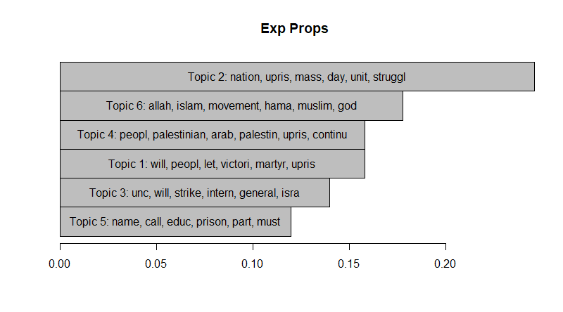

```{r setup, include=FALSE}
knitr::opts_chunk$set(echo = TRUE)
resource_dir <- "W3_Topic_Modeling_ggplot2_files/"
```

# Topic Modeling Overview

## Why Are We Doing This?

Short answer: either because we want to gain insights into a text corpus (and subsequently test hypotheses) that's too big to read, or because the texts are really boring and you don't want to read them all (my case). But now the longer answer.

Although as social scientists our first instinct is often to immediately start running regressions, I would describe topic modeling more as a method of "exploratory data analysis", as opposed to statistical data analysis methods like regression. What this means is, until we get to the Structural Topic Model (if it ever works), we won't be quantitatively *evaluating* hypotheses but rather viewing our dataset through different "lenses", hopefully *generating* testable hypotheses along the way.

There are [whole courses](https://www.coursera.org/learn/exploratory-data-analysis) and [textbooks written by famous scientists](https://books.google.com/books/about/Exploratory_Data_Analysis.html?id=UT9dAAAAIAAJ) devoted solely to Exploratory Data Analysis, so I won't try to reinvent the wheel here. However I will point out that topic modeling pretty clearly dispels the typical critique from the humanities and (some) social sciences that computational text analysis just "reduces everything down to numbers and algorithms" or "tries to quantify the unquantifiable" (or my favorite comment, "a computer can't read a book"). It simply transforms, summarizes, zooms in and out, or otherwise manipulates your data in a customizable manner, with the whole purpose being to help you gain insights you wouldn't have been able to develop otherwise. Note that this doesn't imply (a) that the human gets replaced in the pipeline (*you* have to set up the algorithms and *you* have to do the interpretation of their results), or (b) that the computer is able to solve every question humans pose to it.

## `ggplot2` vs R's "Standard" Plotting Functions

In this tutorial you'll *also* learn about a visualization package called `ggplot2`, which provides an alternative to the "standard" plotting functions built into R. `ggplot2` is another element in the ["tidyverse"](https://www.tidyverse.org/), alongside packages you've already seen like `dplyr`, `tibble`, and `readr` (`readr` is where the `read_csv()` function -- the one with an underscore instead of the dot that's in R's built-in `read.csv()` function -- comes from.). 

The novelty of `ggplot2` over the standard plotting functions comes from the fact that, instead of just replicating the plotting functions that every other library has (line graph, bar graph, pie chart), it's built on a systematic "philosophy" of statistical/scientific visualization called the ["Grammar of Graphics"](https://github.com/rstudio/cheatsheets/blob/master/data-visualization-2.1.pdf). Long story short, this means that it decomposes "a graph" into a set of principal components (can't think of a better term right now lol) so that you can think about them and set them up separately: data, "geometry" (lines, bars, points), mappings between data and the chosen geometry, coordinate systems, facets (basically subsets of the full data, e.g., to produce separate visualizations for male-identifying or female-identifying people), scales (linear? logarithmic?), and themes (pure #aesthetics).

So basically I'll try to argue (by example) that using the plotting functions from `ggplot` is (a) far more intuitive (once you get a feel for the "Grammar of Graphics" stuff) and (b) far more aesthetically appealing out-of-the-box than the "Standard" plotting functions built into R.

First things first, let's just compare a "completed" standard-R visualization of a topic model with a completed `ggplot2` visualization, produced from the exact same data:

*Standard R Visualization*



*`ggplot2` Visualization*


The second one looks way cooler, right? Ok, onto LDA

## What is LDA?

Honestly I feel like LDA is better explained visually than with words, but let me mention just one thing first: LDA, short for [Latent Dirichlet Allocation](https://en.wikipedia.org/wiki/Latent_Dirichlet_allocation) is a [**generative model**](https://en.wikipedia.org/wiki/Generative_model) (as opposed to a [discriminative model](https://en.wikipedia.org/wiki/Discriminative_model), like binary classifiers used in machine learning), which means that the explanation of the model is going to be a little weird. LDA is characterized (and defined) by its assumptions regarding the [**data generating process**](http://sfb649.wiwi.hu-berlin.de/fedc_homepage/xplore/tutorials/xegbohtmlnode5.html) that produced a given text. Specifically, it models a world where you, imagining yourself as an author of a text in your corpus, carry out the following steps when writing a text[^dirichlet]:


1. Assume you're in a world where there are only $K$ possible topics that you could write about. In this case we'll choose $K = 3$: Politics, Arts, and Finance. Each of these three topics is then *defined by* a distribution over all possible words specific to the topic. So, pretending that there are only 6 words in the English language -- "coup", "election", "artist", "gallery", "stock", and "portfolio" -- the distributions (and thus definitions) of the three topics could look like the following:
    ```{r,fake-word-dists}
    word_dists <- list()
    words <- c("coup","election","artist","gallery","stock","portfolio")
    # About to make a data_frame, so need to load the tidyverse
    library(tidyverse)
    politics_probs <- c(0.48, 0.48, 0.01, 0.01, 0.01, 0.01)
    word_dists[["politics"]] <- data_frame(topic="politics",word=words, p=politics_probs)
    arts_probs <- c(0.05, 0.05, 0.45, 0.2, 0.05, 0.2)
    word_dists[["arts"]] <- data_frame(topic="arts",word=words, p=arts_probs)
    finance_probs <- c(0.01, 0.01, 0.01, 0.01, 0.48, 0.48)
    word_dists[["finance"]] <- data_frame(topic="finance",word=words, p=finance_probs)
    # Here we combine the separate data_frames together (just for
    # plotting purposes) using the rbindlist() function from the
    # data.table library
    library(data.table)
    dists_df = as_tibble(rbindlist(word_dists))
    
    # One way to plot it: separate plots by topic
    by_topic <- ggplot(data=dists_df, aes(x=factor(word,words),y=p)) +
      geom_bar(stat="identity", position = "dodge") +
      facet_grid(~factor(dists_df$topic,names(word_dists))) +
      theme(axis.text.x=element_text(angle=45, hjust=1, face="bold")) +
      xlab("Word") + ylab("P(word|topic)")
    by_topic
    # Another way: one plot, each word has three bars
    by_word <- ggplot(data=dists_df, aes(x=factor(word,words),y=p)) +
      geom_bar(aes(fill=factor(topic,names(word_dists))), stat="identity", position="dodge") +
      xlab("Word") + ylab("P(word|topic)") + labs(fill="Topic") 
    by_word
    ```
  
2. Choose a *distribution* over the topics from the previous step, based on how much emphasis you'd like to place on each topic in your writing (on average). For example, if you love writing about politics, sometimes like writing about art, and don't like writing about finance, your distribution over topics could look like:
    ```{r,fake-topic-dist}
    library(tidyverse)
    topic_dist <- data_frame(topic=names(word_dists),p=c(0.6,0.3,0.1))
    # Basic barplot
    ggplot(data=topic_dist, aes(x=factor(topic,names(word_dists)), y=p)) +
      geom_bar(stat="identity") + xlab("Topic") + ylab("P(topic)")
    ```
3. Now we start by writing a word into our document. First we randomly sample a *topic* $T$ from our distribution over topics we chose in the last step. Then we randomly sample a *word* $w$ from topic $T$'s word distribution, and write $w$ down on the page.

4. We repeat step 3 however many times we want, sampling a topic and then a word for each "slot" in our document, filling up the document to arbitrary length until we're satisfied.

This process is summarized in the following image:


### Generating Documents

And if we wanted to create a text using the distributions we've set up thus far, it would look like the following, which just implements Step 3 from above:
```{r, gen-word}
# First I seed the random number generator, so that your
# "random" numbers will match mine
set.seed(1948)
generateWord <- function(topic_dist, word_dists) {
  # 3a. Sample a topic from the topic distribution (corresponds
  # to the colored discs in the figure above)
  # (Note that we could generate a *vector* of draws from
  # the distribution here, and create a whole document in
  # one line, if we wanted)
  sampled_topic <- sample(topic_dist$topic, 1, replace = T, prob = topic_dist$p)
  # 3b. Sample a word from the selected topic's distribution
  # (corresponds to the color-highlighted words in the figure)
  sampled_word <- sample(word_dists[[sampled_topic]]$word, 1, replace = T, prob = word_dists[[sampled_topic]]$p)
  return(list("topic"=sampled_topic, "word"=sampled_word))
}
word_info <- generateWord(topic_dist, word_dists)
print(paste0("Sampled topic: ",word_info$topic))
print(paste0("Sampled word: ",word_info$word))
```

Then we could either keep calling that function again and again until we had enough words to fill our document, or we could do what the comment suggests and write a quick `generateDoc()` function:
```{r, gen-doc}
generateDoc <- function(topic_dist, word_dists, num_words){
  # Sample num_words topics
  topic_vec <- sample(topic_dist$topic, num_words, replace = T, prob = topic_dist$p)
  doc_df <- data_frame(topic=topic_vec, word="")
  # Sample num_words words from the topic distributions, one for
  # each topic in topic_vec
  #num_per_topic <- topic_df %>% group_by(topic) %>% tally()
  #num_art_words <- num_per_topic %>% filter(topic == "Art") %>% pull(n)
  #art_words <- sample(art_dist$Word, num_art_words, replace=T, prob = art_dist$`P(word|topic)`)
  politics_slots <- which(doc_df$topic == "politics")
  arts_slots <- which(doc_df$topic == "arts")
  finance_slots <- which(doc_df$topic == "finance")
  # Now we know how many words to sample from each
  politics_words <- sample(word_dists[["politics"]]$word, length(politics_slots), replace = T, prob = word_dists[["politics"]]$p)
  arts_words <- sample(word_dists[["arts"]]$word, length(arts_slots), replace = T, prob = word_dists[["arts"]]$p)
  finance_words <- sample(word_dists[["finance"]]$word, length(finance_slots), replace = T, prob = word_dists[["finance"]]$p)
  # Now fill in the slots
  doc_df[politics_slots,"word"] = politics_words
  doc_df[arts_slots,"word"] = arts_words
  doc_df[finance_slots,"word"] = finance_words
  return(doc_df)
}
doc_df <- generateDoc(topic_dist, word_dists, 50)
print(doc_df)
# But the "real" final document looks like:
print(paste(doc_df$word, collapse=' '))
```
So yeah it's... not really coherent. No actual human would write like this. BUT it does make sense if you think of each of the steps as representing a simplified model of how humans actually *do* write, especially for particular types of documents: If I'm writing a book about Cold War history, for example, I'll probably want to dedicate large chunks to the US, the USSR, and China, and then perhaps smaller chunks to Cuba, East and West Germany, Indonesia, Afghanistan, and South Yemen. In that case, you *could* imagine sitting down and deciding what you should write that day by drawing from your topic distribution, maybe 30% US, 30% USSR, 20% China, and then 4% for the remaining countries. Then you can also imagine the topic-conditional word distributions, where if you choose to write about the USSR you'll probably be using "Khrushchev" fairly frequently, whereas if you chose Indonesia you may instead use "Sukarno", "massacre", and "Suharto" as your most frequent terms.

The real reason this simplified model helps is because, if you think about it, it *does* match what a document looks like once we apply the bag-of-words assumption, and the original document is reduced to a vector of word frequency tallies. Which leads to an important point.

### Why Would You Ever Generate A Document This Way?

The answer: you wouldn't. Because LDA is a *generative* model, this whole time we have been describing and simulating the data-generating process. But the real magic of LDA comes from when we flip it around and run it "backwards": instead of *deriving* documents from probability distributions, we switch to a likelihood-maximization framework and estimate the *probability distributions* that were most likely to generate a *given* document.

This is really just a fancy version of the toy maximum-likelihood problems you've done in your stats class: whereas there you were given a numerical dataset and asked something like "assuming this data was generated by a normal distribution, what are the most likely $\mu$ and $\sigma$ parameters of that distribution?", now you're given a *textual* dataset (which is not a meaningful difference, since you immediately transform the textual data to numeric data) and asked "what are the most likely Dirichlet priors and probability distributions that generated this data?".

So now you could imagine taking a stack of bag-of-words tallies, analyzing the frequencies of various words, and "backwards inducting" these probability distributions. This is all that LDA does, it just does it way faster than a human could do it.

# Onto the Code

For this particular tutorial we're going to use the same `tm` (Text Mining) library we used in the [last tutorial](../Frequency Analysis.html), due to its fairly gentle learning curve. However, I should point out here that if you really want to do some more advanced topic modeling-related analyses, a more feature-rich library is `tidytext`, which uses functions from the tidyverse instead of the standard R functions that `tm` uses. There is already an entire book on `tidytext` though, which is incredibly helpful and also free, available [here](https://www.tidytextmining.com/). So I'd recommend that over any tutorial I'd be able to write on `tidytext`.
```{r,load-tm}
library(tm)
```
As before, we load the corpus from a .csv file containing (at minimum) a column containing unique IDs for each observation and a column containing the actual text. For this tutorial, our corpus consists of short summaries of US atrocities scraped from [this site](https://github.com/dessalines/essays/blob/master/us_atrocities.md):
```{r,load-corpus}
# If you want to load a corpus from .txt files in a directory, use
#const_corpus <- Corpus(DirSource("constitutions"))
# For loading corpus from csv file, we first load it into a dataframe
library(data.table)
atroc_df <- fread("corpora/us_atroc_corpus.csv")
head(atroc_df)
```
Notice that we have *metadata* (`atroc_id`, `category`, `subcat`, and `num_links`) in the corpus, in addition to our text column. Thus here we use the `DataframeSource()` function in `tm` (rather than `VectorSource()` or `DirSource()`) to convert it to a format that `tm` can work with. Remember from the [Frequency Analysis](../Frequency_Analysis.html) tutorial that we need to change the name of the `atroc_id` variable to `doc_id` for it to work with `tm`:
```{r,convert-to-tm}
# atroc_id is the first column. Rename it to doc_id
names(atroc_df)[1] <- "doc_id"
atroc_corpus <- Corpus(DataframeSource(atroc_df))
atroc_corpus
```
Time for preprocessing. Here you get to learn a new function `source()`. You give it the path to a `.r` file as an argument and it runs that file. It's helpful here because I've made a file `preprocessing.r` that just contains all the preprocessing steps we did in the [Frequency Analysis tutorial](../Frequency_Analysis.html), packed into a single function called `do_preprocessing()`, which takes a corpus as its single positional argument and returns the cleaned version of the corpus.
```{r,preprocessing}
source("Topic_Modeling_ggplot2_files/preprocessing.r")
atroc_clean <- do_preprocessing(atroc_corpus)
```
And we create our document-term matrix, which is where we ended last time. Here I pass an additional keyword argument `control` which tells `tm` to remove any words that are less than 3 characters.
```{r,create-dtm}
#Create document-term matrix
atroc_dtm <- DocumentTermMatrix(atroc_clean, control=list(wordLengths=c(3,Inf)))
```

## Running LDA

Now it's time for the actual topic modeling! The key thing to keep in mind is that at first you have no idea what value you should choose for the number of topics to estimate $K$. Later on we can learn smart-but-still-dark-magic ways to choose a $K$ value which is "optimal" in some sense. But for now we just pick a number and look at the output, to see if the topics make sense, are too broad (i.e., contain unrelated terms which should be in two separate topics), or are too narrow (i.e., two or more topics contain words that are actually one "real" topic).
```{r,run-lda}
library(topicmodels)
K <- 15
atroc_lda <-LDA(atroc_dtm, K, method="Gibbs", control=list(seed=1948))
```
Now we produce some basic visualizations of the parameters our model estimated:
```{r,first-plots}
# Plot the top N words by topic!
# Now some sort of tidyverse stuff. Stolen from
# https://www.tidytextmining.com/topicmodeling.html
library(tidytext)
atroc_topics <- tidy(atroc_lda, matrix = "beta")

library(ggplot2)
library(dplyr)
terms_per_topic <- 10
atroc_top_terms <- atroc_topics %>%
#    filter(topic==6 | topic==8) %>%
    group_by(topic) %>%
    top_n(terms_per_topic, beta) %>%
    ungroup() %>%
    arrange(topic, -beta)
# top_n() doesn't handle ties -__- so just take top 10 manually
atroc_top_terms <- atroc_top_terms %>%
    group_by(topic) %>%
    slice(1:terms_per_topic) %>%
    ungroup()

atroc_top_terms$topic <- factor(atroc_top_terms$topic)

atroc_top_terms %>%
  mutate(term = reorder(term, beta)) %>%
  ggplot(aes(term, beta)) +
  geom_bar(stat = "identity") +
  facet_wrap(~ topic, scales = "free") +
  theme(axis.text.x = element_text(angle = 90, hjust = 1)) +
  coord_flip()
# For more plots see
# https://cran.r-project.org/web/packages/tidytext/vignettes/topic_modeling.html
```

```{r,junk,eval=FALSE}
metacomm_tidy %>%
  count(word, sort = TRUE) %>%
  filter(n > 190) %>%
  mutate(word = reorder(word, n)) %>%
  ggplot(aes(word, n)) +
  geom_col() +
  xlab(NULL) +
  coord_flip() +
  theme(axis.text=element_text(size=16),
        axis.title=element_text(size=16))
```

```{r,optimize-k-simple,eval=FALSE}
######################################################
### NEW SECTION: Optimizing the number of topics K ###
######################################################

# You'll need to run install.packages("ldatuning")
# in the console before this line will work
library(ldatuning)
# Compute the K value "scores" from K=2 to K=15
result <- FindTopicsNumber(
    comm_dtm,
    topics = seq(from = 2, to = 15, by = 1),
    metrics = c("Griffiths2004", "CaoJuan2009", "Arun2010", "Deveaud2014"),
    method = "Gibbs",
    control = list(seed = 1948),
    mc.cores = 2L,
    verbose = TRUE
)
# Plot the scores, with graphs labeled "minimize" or
# maximize based on whether it's a metric you want
# to minimize or maximize
FindTopicsNumber_plot(result)
```


```{r, bayanat-stuff, eval=FALSE}
comm_post <- posterior(comm_lda)
comm_phi <- comm_post$terms
colnames(comm_dtm_mat) <- as.character(1:30)
comm_coherence <- CalcProbCoherence(phi = comm_phi, dtm = comm_dtm_mat, M = 5)


nih_m <- FitLdaModel(dtm = nih_sample_dtm, 
                 k = 5, 
                 iterations = 200, 
                 cpus = 1)

# Ok, NOW I'm trying to *compare* the two groups by
# topic emphasis...
# comm_post$topics is a num_docs x num_topics matrix
doc_dists <- tidy(comm_lda, matrix="gamma")
# 1 to 25 are hamas. 26 to 53 are unc.
doc_dists <- doc_dists %>%
    mutate(group = ifelse(document %in% 1:25, "Hamas", "UNC"))

# Try totaling the doc topic proportions by group
total_props <- doc_dists %>% group_by(group, topic) %>% summarize(total_gamma=sum(gamma), avg_gamma=mean(gamma))
# And sort by group x gamma
total_props <- total_props %>% group_by(group) %>% arrange(group, desc(avg_gamma))

### MY TOPIC LABELS ###
# 6 = incarceration
# 8 = education
# 15 = foreign relations (broader mid east)
# 12 = martyrdom
# 13 = peace plan
# 4 = strikes

### TOP BY GROUP ###
# unc: 25=0.56, 30=0.676, 12=0.0386, 13=0.0373, 4=0.0282
# hamas: 7=0.395, 25=0.0842, 13=0.0591, 24=0.0365, 8=0.0364

# Here goes nothing
total_props <- total_props %>%
    mutate(label=case_when(
        topic==4 ~ "Strikes",
        topic==6 ~ "Incarceration",
        topic==7 ~ "Islam",
        topic==8 ~ "Education",
        topic==12 ~ "Martyrdom",
        topic==13 ~ "Peace Plan",
        topic==15 ~ "Mid East",
        topic==25 ~ "Nationalism"
    ))

# Ok now only keep labeled topics
labeled_props <- total_props %>% filter(!is.na(label))

# Capitalize the groups
labeled_props <- labeled_props %>%
    ungroup() %>%
    mutate(group = ifelse(group=="hamas", "Hamas", "UNC")) %>%
    group_by(group)

# Uncomment this to drop Islam, Nationalism
labeled_props <- labeled_props %>%
    filter(label != "Islam") %>%
    filter(label != "Nationalism")

# Try to plot by label
labeled_props %>%
    ggplot(aes(x=label,y=avg_gamma,fill=group)) +
    geom_bar(stat="identity",position="dodge") +
    theme(axis.text.x=element_text(size=24, angle=45, hjust=1, face="bold"),
          axis.text.y=element_text(size=18),
          axis.title=element_text(size=18),
          plot.title = element_text(size=24, hjust = 0.5),
          legend.text = element_text(size=24),
          legend.title = element_blank()) +
    labs(x = "(Stemmed) Word", y = "Proportion of Group's Texts") + 
    #scale_fill_discrete(name = "Group") +
    ggtitle("Per-Group Topic Frequencies")
```
    
# Choosing an "Optimal" Value for $K$

```{r,opt-k,eval=FALSE}
## This is if you want to "optimize" K
#library(topicmodels)
## In case of errors when installing topicmodels:
## http://tinyheero.github.io/2016/02/20/install-r-topicmodels.html
```
    
[^dirichlet]: I'm simplifying by ignoring the fact that all distributions you "choose" are actually sampled from a Dirichlet distribution $\mathsf{Dir}(\alpha)$, which is a probability distribution *over* probability distributions, with a single parameter $\alpha$. The best way I can explain $\alpha$ is that it controls the "evenness" of the produced distributions: as $\alpha$ gets higher (especially as it increases beyond 1) the Dirichlet distribution is more and more likely to produce a *uniform* distribution over topics, whereas as it gets lower (from 1 down to 0) it is more likely to produce a non-uniform distribution over topics, i.e., a distribution weighted towards a particular topic or subset of the full set of topics.
