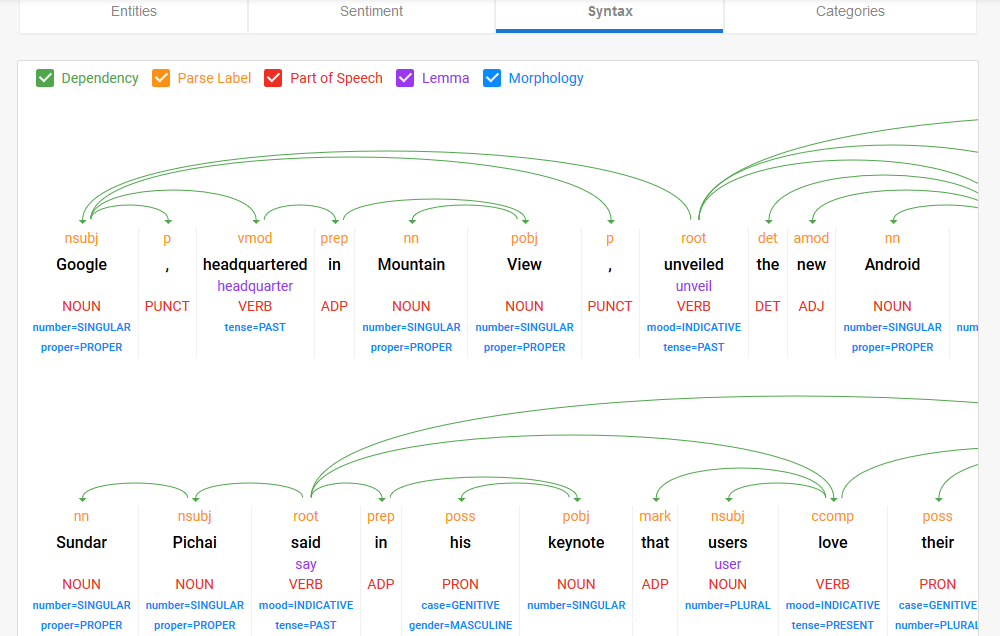

```{r setup, include=FALSE}
knitr::opts_chunk$set(echo = TRUE)
```

# What Types of Information Can We Extract from a Sentence?

The answer to this question is actually illustrated by the results that the [Google Cloud Natural Language API](https://cloud.google.com/natural-language/) gives back when you send it a sentence:

* 

In this tutorial, we'll be talking about this final method, Named Entity Recognition.

```{r,init-api}
library(googleLanguageR)
gl_auth("../gcloud/nlp_api_teaching.json")
gramsci <- "The subaltern classes, by definition, are not unified and cannot unite until they are able to become a 'State': their history, therefore, is intertwined with that of civil society, and thereby with the history of States and groups of States"
greenwald <- c("If fighting Israeli occupying forces is barred as 'terrorism,' and nonviolent boycotts against Israel are barred as 'anti-Semitism,' then what is considered a legitimate means for Palestinians and their allies to resist and end the decades-long, illegal Israeli occupation?","The answer is: nothing.","Palestinians are obliged to submit to Israeli occupation in a way that none of the people demanding that would ever themselves submit to occupation of their land.","All forms of resistance to Israeli occupation are deemed illegitimate.","That, manifestly, is the whole point of all of this.")
wiki <- "In June 1982, the Israel Defense Forces invaded Lebanon with the intention of rooting out the PLO."


wiki2 <- "By mid-1982, under the supervision of the Multinational Force, the Palestine Liberation Organization withdrew from Lebanon following weeks of battles in West Beirut and shortly before the massacre took place very long ago."
yarmouk <- "The largest Palestinian refugee camp in Syria has been 'transformed into a death camp' as Assad regime forces press ahead with a major offensive against Islamic State of Iraq and the Levant fighters who control the area, the United Nations has warned."
combined <- "By mid-1982, under the supervision of the Multinational Force, the Palestine Liberation Organization withdrew from Lebanon following weeks of battles in West Beirut and shortly before the massacre took place."

nlp_result <- gl_nlp(c(wiki2,yarmouk,combined))
```

```{r,print-entities}
nlp_result$entities
```

```{r,print-tokens}
nlp_result$tokens
```

```{r,print-classify}
nlp_result$classifyText
```

```{r,print-sentiment}
nlp_result$sentences[[1]]$score
nlp_result$sentences[[2]]$score
```

```{r,do-translation}
y_trans <- gl_translate(yarmouk, "es")
```

```{r,print-translation}
y_trans$translatedText
```

```{r,find-lebanon}
# Using tidyverse (dplyr and readr) from this cell onwards
library(tidyverse)
doc_nouns <- list()

for (doc_num in c(1,2,3)) {
  doc_nouns[[doc_num]] <- nlp_result$entities[[doc_num]] %>% filter(mention_type == "PROPER") %>% filter(salience > 0.5)
}

docs_with_lebanon <- c()
for (doc_num in c(1,2,3)) {
  docs_with_lebanon <- c(docs_with_lebanon, "Lebanon" %in% doc_nouns[[doc_num]]$name)
}

```
```{r,trump-entities}
nlp_result$entities
```

```{r,load-speeches}
UN_speeches <- read_csv("corpora/UNGDC_2017_ascii.csv")
```

```{r,find-trump}
entity_list = list()
trump_list = list()
num_speeches = nrow(UN_speeches)
# could check *all* speeches, using: for (i in 1:num_speeches) {}
# here we'll just check two (already could be fairly expensive
# if you pass the free tier), and only send the first 500 chars
for (speech_num in 3:4){
  cur_speech <- UN_speeches[speech_num,"text"]
  cur_speech_head <- substr(cur_speech, 1, 500)
  cur_result <- gl_nlp(cur_speech_head)
  cur_entities <- cur_result$entities
  entity_list[[speech_num]] <- cur_entities
  has_trump <- "Trump" %in% cur_entities
  trump_list[[speech_num]] <- has_trump
}

print(entity_list)
trump_vec <- unlist(trump_list)
print(which(trump_vec))
```