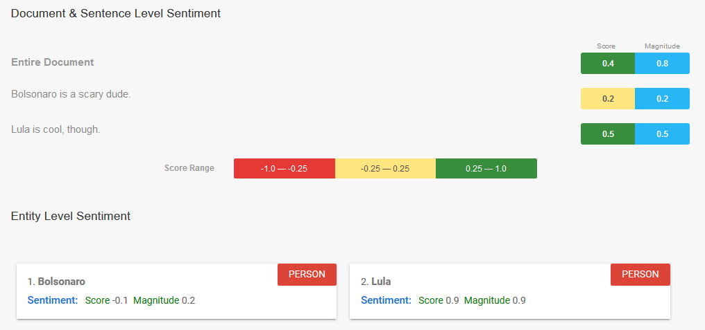
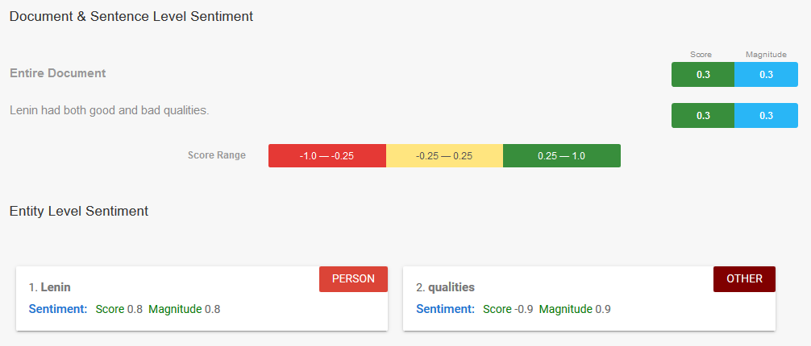
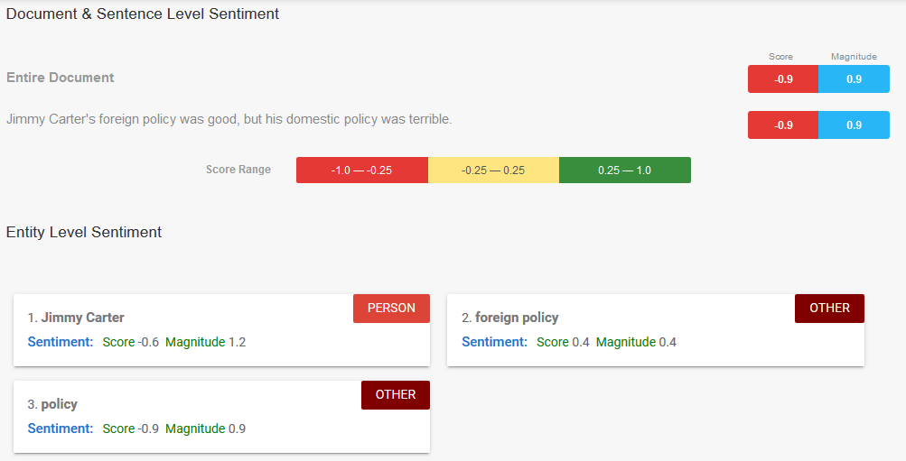
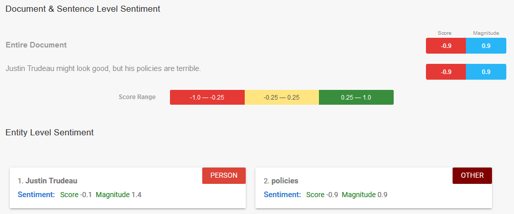

```{r setup, include=FALSE}
knitr::opts_chunk$set(echo = TRUE)
```

# Introduction

Sentiment analysis is a new-ish technique within Natural Language Processing, and one which often makes anyone outside of Computer Science cringe profusely, due to the simplicity of early models. Actually, to this day, unless you're working somewhat close to the "cutting edge" of sentiment analysis, the "off-the-shelf" models are pretty cringey, in that they usually just give a score from "extremely bad" to "extremely good" rather than trying to capture the nuances of emotional valence.

In these researchers' defense, though, this simplistic scale makes a lot of sense given the problems that were initially undertaken by the field. For example, some of the earliest work was done on [IMDB movie reviews](http://ai.stanford.edu/~amaas/data/sentiment/), where users provide both a textual review *and* a score from 1 to 5 stars. The researchers then simply aimed to predict, using only the text, what the user gave the movie, hence the 1 to 5 "bad" to "good" scale.

It's also not so bad for social science researchers, either (as compared to, say, psychologists), since many of our surveys still ask questions like "How do you feel about Trump's decision to move the US embassy in Israel to Jerusalem"? And prompt the user to pick a discrete Likert-scale rating from "Strongly Disagree" to "Strongly Agree". Thus in this tutorial we'll be using this type of simplified single-dimensional sentiment analysis model, but just know that you can dig deeper and find more nuanced multi-dimensional models.

# The Libraries

We'll be working with a few different sentiment analysis libraries here, each of which are suited to different research settings: first, we'll look at `sentimentr`, an R library that you can quickly download using `install.packages("sentimentr")` and start analyzing sentences immediately. This library probably has the simplest learning curve of the three. Then we'll switch to the [Google Cloud Natural Language API](https://cloud.google.com/natural-language/), a far more powerful (but potentially costly) library which can process thousands of sentences per second. Hopefully this will make the tutorial useful for you, since if your project's $N$ is in (say) the hundreds you can just use `sentimentr` on your local machine, and if its $N$ is in the thousands or millions you can instead opt to use the Google API. Finally, we'll carry out a more realistic sentiment analysis project by using the `syuzhet` library, which (among other features) allows you to measure sentiment on multiple dimensions -- as opposed to the "good" vs. "bad" dimension measured by `sentimentr` and the Google API -- and has a simple interface allowing you to easily plot sentiment over time.

# Quick Demos

## `sentimentr` Demo

Before we dive in, we can do two quick demos illustrating the features of both libraries. Let's start with `sentimentr` by loading the library into working memory using the `library()` function:
```{r,sentr-demo}
library(sentimentr)
```

Now, to see how sentiment analysis works at the most basic level, let's give it two sentences -- the first one unambiguously expressing a negative sentiment, the other a positive sentiment:
```{r,sentr-bolsonaro}
bolsonaro_lula <- "Bolsonaro is scary, dude. Lula is cool, though."
sentiment(bolsonaro_lula)
```

Cool, so that worked as expected. To understand why, we can use `sentimentr`'s `extract_sentiment_terms()` to see specifically which terms it picked up as particularly negative and which it picked up as positive:
```{r,bolsonaro-terms}
extract_sentiment_terms(bolsonaro_lula)
```

Now let's try a sentence containing both a positive and a negative sentiment, but with the *same* magnitude, so that the sentence essentially has a neutral sentiment when treated as a whole (i.e., a sentence where the negative and positive sentiments "cancel out"):
```{r,sentr-lenin}
lenin <- "Lenin had both good and bad qualities."
sentiment(lenin)
```
Nice! It was able to recognize the "magnitude" of the two contrasting parts of the sentence, so that in the end the sentence comes out neutral. We can again take a look at the specific terms to understand why:
```{r,lenin-terms}
extract_sentiment_terms(lenin)
```

Finally, let's try a case where the sentence has both positive and negative sentiment, but with *asymmetric* magnitudes, such that the negative sentiment is far more extreme than the positive:
```{r,sentr-carter}
carter_sent <- "Jimmy Carter's foreign policy was good, but his domestic policy was terrible."
sentiment(carter_sent)
extract_sentiment_terms(carter_sent)
```
So here we have our first weird result: the sentiment score is "correct", in that the sentence is overall negative due to "terrible" having a greater negative magnitude than "good"'s positive magnitude, but this score is probably skewed by the fact that `sentimentr` considers both "foreign" and "domestic" to be negative words, in addition to "terrible". So let's see what happens if we force it to just compare "good" and "terrible":
```{r,sentr-trudeau}
trudeau <- "Justin Trudeau might look good, but his policies are terrible."
trudeau_result <- sentiment(trudeau)
trudeau_result
extract_sentiment_terms(trudeau)
```
And thus we obtain the expected behavior: it recognizes that "terrible" is more negative than "good" is positive, so that the overall score comes out negative. These prior two examples are really just to show you that you should always be careful about the sentiment scores, and try to "dig" into them as much as possible, since they might be driven by extraneous factors like the valences ascribed to "domestic" and "foreign" by `sentimentr`.

## Google Cloud API Demo

Now let's check out a Google Cloud Natural Language API example. Although below we'll use R to make calls to this API, for now let's just copy and paste those same sentences into Google's [online demo](https://cloud.google.com/natural-language/) (it should appear directly under the "Powerful Text Analysis" section, though sometimes it takes a while to load):







To be honest I'm a bit taken aback by how un-intuitive these scores are, but again for projects with a high number of documents, it may be the best choice regardless.

## `syzhet` Demo

```{r,syuzhet-demo}
library(syuzhet)
dead_prez <- c("I want to be free to live, able to have what I need to live.", "Bring the power back to the streets, where the people live."," We're sick of working for crumbs and filling up the prisons, dying over money and relying on religion for help.")

get_sentiment(dead_prez)
get_nrc_sentiment(dead_prez)
```

# `sentimentr`

Although the `sentimentr` demo above is interesting, you're (hopefully) not usually going to be working with text that you manually type into R. So here we look at how to load a *corpus* of texts and obtain sentiment information for each one.

# `GoogleLanguageR`

To interface with the Google Language API programmatically, we will use the extremely convenient [`GoogleLanguageR` package](https://github.com/ropensci/googleLanguageR).

```{r,goog-auth}
library(googleLanguageR)
gl_auth("../gcloud/nlp_api_teaching.json")
```

```{r,goog-api}
texts <- c("The Tuskegee Study of Untreated Syphilis in the Negro Male was an infamous and unethical clinical study conducted between 1932 and 1972 by the U.S. Public Health Service. The purpose of this study was to observe the natural history of untreated syphilis; the African-American men in the study were told they were receiving free health care from the United States government.","Investigators enrolled in the study a total of 600 impoverished, African-American sharecroppers from Macon County, Alabama. The men were told that the study was only going to last six months, but it actually lasted 40 years. After funding for treatment was lost, the study was continued without informing the men that they would never be treated. None of the men were ever told that they had the disease, and none were treated with penicillin even after the antibiotic was proven to successfully treat syphilis.")
nlp_result <- gl_nlp(texts)
attributes(nlp_result)
```
So we see that, broadly speaking, we can get information about the sentences, tokens (roughly corresponding to words), entities (people, places, proper nouns), language detection, text (the original text we sent to the API), document sentiment, and categorical classification of the text.

```{r,nlp-result}
nlp_result$sentences
nlp_result$documentSentiment
```

```{r,nlp-entities}
cols <- c("name","type","salience","score","magnitude")
nlp_result$entities[[1]][cols]
nlp_result$entities[[2]][cols]
nlp_result$classifyText
```

# `syuzhet`

Finally, let's do something that resembles a project you might actually carry out for actual social science research! For a separate project I (grudgingly) scraped every Donald Trump tweet, from the beginning of his Twitter account to the present day (updated as needed... I might have an API set up to automatically do this... or I might not... You'll have to ask to find out... More ellipses...), giving 36,724 in total, as of February 8th, 2019. Let's [use `syuzhet`](https://cran.r-project.org/web/packages/syuzhet/vignettes/syuzhet-vignette.html) to see how Trump's mood has fluctuated over the years:
```{r,load-trump}
trump_df <- read_csv("Sentiment_Analysis_files/trump_tweets.csv")
```

```{r,trump-sentiment}
trump_sentiment <- get_sentiment(trump_df$text)
```
And now we join each sentiment score with the corresponding date of the tweet, to obtain a simple tibble containing dates and sentiment scores for each tweet.
```{r,join-trump}
trump_df$sentiment <- trump_sentiment
```
And some quick summary statistics of the sentiment scores, just so we can get a feel for its range before plotting:
```{r,trump-sumstats}
mean(trump_df$sentiment)
median(trump_df$sentiment)
min(trump_df$sentiment)
max(trump_df$sentiment)
# No built-in mode function in R :/
my_mode <- function(x) {
  ux <- unique(x)
  ux[which.max(tabulate(match(x, ux)))]
}
my_mode(trump_df$sentiment)
```
And a quick scatterplot where the points are evenly spaced (i.e., plotted by order rather than actual date), which we should be careful not to over-interpret, but which we can get some initial impressions from. For example, it looks at first glance like Trump becomes more "emotionally volatile" as time goes on.
```{r,plot-trump}
plot(trump_sentiment)
```

Now the actual time plot. For this we just need to convert the date column (which is currently just in string format) into actual R date objects, using `as.Date()`:
```{r,date-convert}
trump_df$r_date <- as.Date(trump_df$created_at)
```

```{r,plot-date}
p <- ggplot(trump_df, aes(r_date, sentiment)) + geom_line() + theme(legend.position = "bottom")
p
```